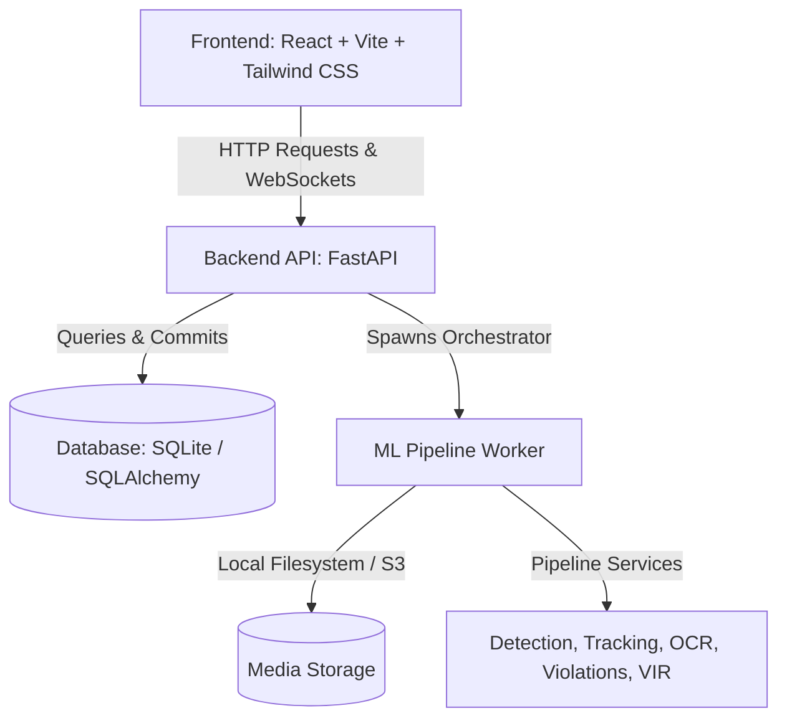
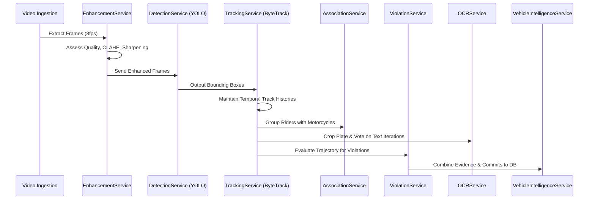

# Traffic Intelligence & Violation Detection Platform

This document provides a comprehensive technical overview of the **Traffic Intelligence & Violation Detection Platform**—an automated system designed to ingest traffic surveillance footage, track vehicles in real-time, detect multi-violation events, recognize license plates, and generate official citations.

---

## 1. System Architecture

The application recently transitioned to a **Vehicle Intelligence Record (VIR) Centric Architecture**. Rather than tracking isolated violations, the entire pipeline is centered around a persistent vehicle identity profile.

### Stack Components
1. **Frontend**: React SPA powered by Vite, utilizing Tailwind CSS for UI components, Lucide icons, and browser-based printing/PDF rendering engines.
2. **Backend**: FastAPI framework, SQLAlchemy ORM, SQLite database (for localized metadata storage), and JWT for secure officer authentication.
3. **ML Pipeline Services**: Abstracted, microservice-like layers wrapping `OpenCV`, `YOLOv8s`, `ByteTrack`, and `EasyOCR`.

---

## 2. API Routes Documentation

All endpoints are prefixed with `/api` and require a JWT token (`Authorization: Bearer <token>`) except for registration and login.

### Authentication Router (`/api/auth`)
*   **`POST /register`**: Registers a new traffic officer/authority user.
*   **`POST /login`**: Validates credentials and returns a JWT access token.
*   **`GET /me`**: Retrieves the profile details of the currently authenticated officer.

### Video Router (`/api/videos`)
*   **`POST /upload`**: Uplinks a surveillance video file, sets configuration details (speed limit, stop line), and schedules asynchronous ML processing.
*   **`GET /my`**: Lists all videos uploaded by the current officer.
*   **`GET /{video_id}/status`**: Returns the processing status via WebSockets and HTTP.
*   **`GET /{video_id}/results`**: Returns full VIR metadata for the video alongside the list of detected violations with coordinate mappings and S3 URLs.

### Violation Router (`/api/violations`)
*   **`GET /`**: Search endpoint. Filters normalized VIR records by plate number.
*   **`GET /{video_id}`**: Retrieves a chronologically sorted list of violations.
*   **`GET /analytics/repeat-offenders`**: Analyzes the database to compile repeat offending license plates across all tracking histories.
*   **`GET /analytics/hotspots`**: Analyzes vehicle trajectories and speed centroids to find geographical violation hotspots.

---

## 3. The Modular Machine Learning Pipeline

The video processing task runs in a background thread orchestrated by `workers/process_video.py`. Logic is strictly separated into independent services:

---

## 4. Key Implementation Technologies & Details

### A. Video Enhancement (`EnhancementService`)
Surveillance footage is often compromised by weather, glare, or low light. 
*   **Technique**: Quality Assessment Routing. The service calculates frame brightness, contrast, and blurriness using variance of Laplacian.
*   **Enhancements**: Applies Contrast Limited Adaptive Histogram Equalization (`CLAHE`) for poor lighting, and Unsharp Mask filters for blurred frames.

### B. Object Detection & Tracking (`DetectionService` + `TrackingService`)
*   **Detection**: Uses `YOLOv8s` trained to identify standard traffic components: Cars, Motorcycles, Trucks, Buses, Helmets, and License Plates.
*   **Tracking**: Uses `ByteTrack`, an advanced multi-object tracker that excels at maintaining ID consistency across occlusions without heavy computational overhead.

### C. Speed & Overspeeding Detection (Camera-Angle-Free)
To remove the need for manual scale calibration, the pipeline calculates real-world speed dynamically based on perspective:
1. **Physical Standard Reference**: Assumes real-world vehicle heights based on class (`Car`: 1.5m, `Motorcycle`: 1.0m, `Truck`: 3.0m).
2. **Height Scale Conversion**: 
   $$\text{scale (meters/pixel)} = \frac{\text{Physical Height (m)}}{\text{Bbox Height in pixels}}$$
3. **Exact Time-Delta Speed Calculation**:
   $$\text{Velocity} = \frac{\text{Distance in pixels} \times \text{scale}}{\text{timestamp} - \text{prev\_timestamp}}$$
   This makes speed estimation completely independent of manual perspective lines.

### D. Lane Detection & Wrong-Side Driving (Self-Calibrating)
Instead of hardcoding road lane lines, the system learns road rules dynamically from active traffic flow:
1. **Dynamic Flow Consensus**: Every moving vehicle creates a directional vector (`dy`). The system keeps a running consensus of the dominant flow for the left and right halves of the screen.
2. **Single-Lane / One-Way Street Adaptation**: If the median flow direction on both the left and right sides of the screen match, the system automatically detects that the road is a one-way street or a single lane, and enforces this single global direction.
3. **Violation Trigger**: A vehicle is flagged for **Wrong-Side Driving** if its velocity vector is in direct opposition to the dynamic consensus direction (either the global one-way consensus, or the specific side of the road on a two-way street).

### E. Associated Helmet & Triple-Riding Attribution (`AssociationService`)
Traditional systems process helmet classifications at the individual passenger level. 
1. **Intersection over Union (IoU)**: The service maps rider bounding boxes to motorcycle bounding boxes.
2. **Group Checks**: It counts riders (for Triple Riding) and checks class labels (Helmet vs No Helmet) for associated riders.
3. **Attribution**: Violations are attributed directly to the **motorcycle's track ID** ensuring citations land on the vehicle plate, not the anonymous passenger.

### F. Advanced Plate Preprocessing & Iterative OCR (`OCRService`)
*   **Pipeline**: Uses `EasyOCR` after passing plate crops through a dedicated preprocessing pipe (4x Lanczos Upscaling + Morphological Operations + CLAHE).
*   **Identity Convergence**: Because OCR confidence fluctuates frame-to-frame, the tracker maintains a sliding window of the last `N` license plate reads. The `converge_plate_identity()` method votes on the most commonly detected alphanumeric sequence to lock in the final, highly-accurate plate.

### G. Vehicle Intelligence Record (VIR) Database Schema
The database operates strictly on a normalized relational schema, migrating away from flat JSON logs. 
*   **Core Entity**: `VehicleIntelligenceRecord`
*   **Relationships**: `TrackHistory` (speed & bounds), `OCRHistory` (plate guesses), `RiderAssociation`, and `EvidenceBundle` (final S3 frames and violation types).
