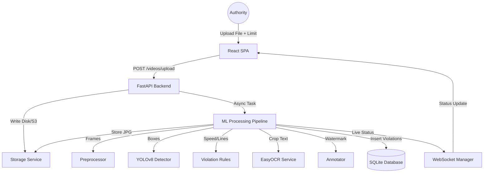

# Traffic Violation Platform Walkthrough

A production-grade, locally runnable traffic infraction console using FastAPI, SQLite, and React (Vite/Tailwind). The app handles async processing on CPU and serves secure expiring media fallback links without requiring AWS or Docker.

---

## System Architecture

The following diagram illustrates the data flow from upload to visual evidence review:



---

## Proposed Database Schema

We have configured `database.py` with SQLAlchemy, initializing standard model files on application start:

| Table | Model Class | Fields | Purpose |
| :--- | :--- | :--- | :--- |
| **users** | `User` | `id`, `email`, `hashed_password`, `name`, `role`, `created_at` | Authenticates traffic authorities via secure JWT tokens |
| **videos** | `Video` | `id`, `uploaded_by`, `original_filename`, `s3_key`, `s3_url`, `status`, `speed_limit`, `stop_line_y`, `created_at`, `processed_at` | Tracks uploaded files, active processing status, and user-specified speed limits |
| **violations** | `Violation` | `id`, `video_id`, `plate_number`, `violation_type`, `timestamp_in_video`, `frame_number`, `confidence_score`, `bounding_boxes`, `annotated_frame_s3_url`, `created_at` | Stores detailed infraction instances with bounding boxes and signed evidence URLs |

---

## API Mappings

All API endpoints are prefixed with `/api` and require a JWT token in the `Authorization` header (except auth endpoints):

*   **Auth**:
    *   `POST /api/auth/register` - Registers a new authority user.
    *   `POST /api/auth/login` - Signs in and returns a JWT access token.
*   **Videos**:
    *   `POST /api/videos/upload` - Receives video clip (multipart), writes to local/S3 storage, creates DB entry, launches async BackgroundTask.
    *   `GET /api/videos/my` - Returns list of videos uploaded by current logged-in user.
    *   `GET /api/videos/{video_id}/status` - Returns processing status and current count of flagged violations.
    *   `GET /api/videos/{video_id}/results` - Returns comprehensive video metadata and list of all detected violations.
*   **Violations**:
    *   `GET /api/violations?plate={query}` - Returns historical infractions matching specific vehicle registration plates.
    *   `GET /api/violations/{video_id}` - Returns all infractions for a specific video.
*   **Media Serving (S3 Emulator)**:
    *   `GET /media/{file_path}?expires={epoch}&signature={hmac}` - Serves local video and image frames while enforcing cryptographic expiration and security validation.
*   **WebSockets**:
    *   `WS /ws/video/{video_id}` - Pushes live pipeline status updates (e.g. Extracting, Detecting, Complete) directly to clients.

---

## File Registry & Changes

We have created/modified the following items in the project workspace:

*   [config.py](file:///c:/Users/91891/OneDrive/Desktop/round-2/backend/config.py) — Configures databases, JWT, and S3 credentials.
*   [database.py](file:///c:/Users/91891/OneDrive/Desktop/round-2/backend/database.py) — Initialized SQLAlchemy SQLite connection engine.
*   [s3_service.py](file:///c:/Users/91891/OneDrive/Desktop/round-2/backend/services/s3_service.py) — Handles file transfers and generates HMAC signatures for local runs.
*   [process_video.py](file:///c:/Users/91891/OneDrive/Desktop/round-2/backend/workers/process_video.py) — Main background thread execution pipeline.
*   [main.py](file:///c:/Users/91891/OneDrive/Desktop/round-2/backend/main.py) — FastAPI setup, websocket channels, and secure media route.
*   [App.jsx](file:///c:/Users/91891/OneDrive/Desktop/round-2/frontend/src/App.jsx) — Scaffolding React router.
*   [Dashboard.jsx](file:///c:/Users/91891/OneDrive/Desktop/round-2/frontend/src/pages/Dashboard.jsx) — Layout panel for upload and logs.
*   [VideoDetail.jsx](file:///c:/Users/91891/OneDrive/Desktop/round-2/frontend/src/pages/VideoDetail.jsx) — Real-time tracking and results console.
*   [PlateSearch.jsx](file:///c:/Users/91891/OneDrive/Desktop/round-2/frontend/src/pages/PlateSearch.jsx) — Database plate query screen.

---

## Instructions for Running the App

Follow these simple steps to run and test the platform manually:

### 1. Start the Backend API
1. Navigate to the backend directory and install dependencies using Python 3.10:
   ```powershell
   cd backend
   py -3.10 -m pip install -r requirements.txt --default-timeout=1000
   ```
2. Set up your environment by copying `.env.example` to `.env`. For local runs, you do not need AWS credentials.
3. Start the FastAPI server on port 8000 using Python 3.10:
   ```powershell
   py -3.10 -m uvicorn backend.main:app --reload --port 8000
   ```

### 2. Start the React Frontend
1. Navigate to the frontend directory:
   ```powershell
   cd ../frontend
   ```
2. Start the Vite React development server:
   ```powershell
   npm run dev
   ```
3. Open your browser and navigate to `http://localhost:5173`. Create a user account on the login screen, upload a test clip, and watch the processing stage transition live via WebSockets.
